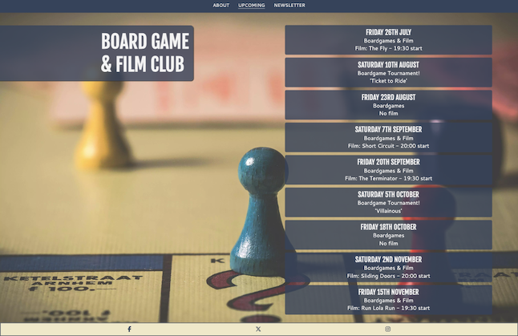
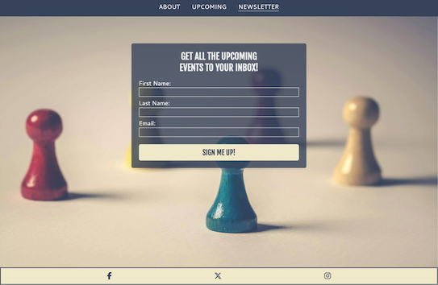

# Board Game & Film Club

Board Game & Film Club is a site to inform people about their local club in Maidstone where they can come and play games and watch films. It is targeted at both current members and potential new members who want a bit of classic fun and to make new friends. It will be useful to current and new members as it lists event details for future meets and also gives the opportunity to sign up to a newsletter via email. 

## Features
- ### Title & Hero Image
  - The title for the homepage floats above the hero image and scrolls with the page. The image used is a classic boardgame which is eyecatching and instantly recognisable. When the upcoming page is being viewed on tablet size and above, the title remains in place while the content scrolls next to it.

         

- ### Navigation Bar
  - The navigation bar appears differently depending on whether the user is on a hand held mobile device such as phones and tablets, or using larger devices such as Laptops and Desktops.
  - Hand held devices have the navigation bar at the bottom with a burger menu to access the links. This is for easier one handed accessibility. 
  
    
  
  - Larger devices have the navigation bar at the top of the page and the links are expanded so in view all the time.

    

- ### Club details section
  - This section tells the user the important information about the club including links to the appropriate sections of the site for more details on location, upcoming events and how to sign up to the newsletter.

    

- ### Map integration
  - The embedded Google map shows the location of where the club meets. This is for potential new members so they can see exactly where to find the club.
  - The link to open the larger map opens in a separate tab.

    

- ### Footer
  - The footer has the links to the clubs social media. This encourages the user to conmect via social media.
  - Links open in a separate tab.

    

- ### Upcoming Events page
  - This section of the site gives both current members and potential new members all the info they need on what's happening in upcoming meets.
  - This gives them the ability to plan whether they want to attend certain dates or not.

    

- ### Newsletter page
  - This page gives the user the option to sign up to an email newsletter that would send out info about the club.
  - This might include highlights of the last meet, details on the next few meets and any other interesting news.

     

### Future Features

  - I would like to add a feature on the pages that the floating title scrolls. When the title scrolls out of view I'd like to change it to a static bar at the top similar to the navbar when it is at the top.
  - A forum page would also be good for members as they can discuss future meets, ideas about the club and connect.

## Testing
