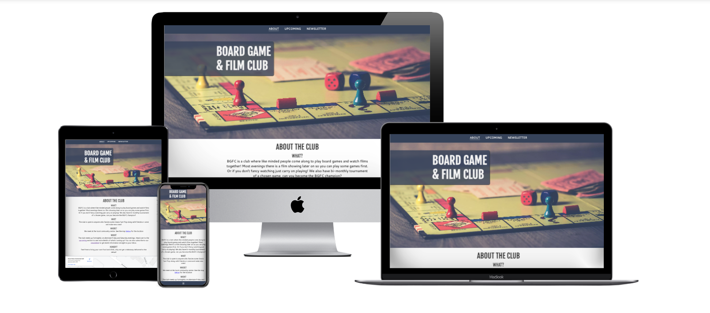
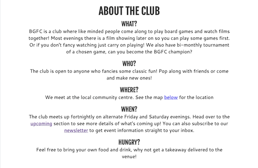
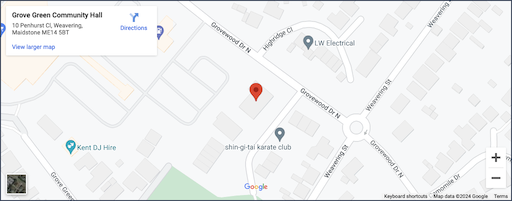

# Board Game & Film Club

Board Game & Film Club is a site to inform people about their local club in Maidstone where they can come and play games and watch films. It is targeted at both current members and potential new members who want a bit of classic fun and to make new friends. It will be useful to current and new members as it lists event details for future meets and also gives the opportunity to sign up to a newsletter via email. 

## Features
- ### Title & Hero Image
  - The title for the homepage floats above the hero image and scrolls with the page. The image used is a classic boardgame which is eyecatching and instantly recognisable. When the upcoming page is being viewed on tablet size and above, the title remains in place while the content scrolls next to it.

         

- ### Navigation Bar
  - The navigation bar appears differently depending on whether the user is on a hand held mobile device such as phones and tablets, or using larger devices such as Laptops and Desktops.
  - Hand held devices have the navigation bar at the bottom with a burger menu to access the links. This is for easier one handed accessibility. 
  
    
  
  - Larger devices have the navigation bar at the top of the page and the links are expanded so in view all the time.

    

- ### Club details section
  - This section tells the user the important information about the club including links to the appropriate sections of the site for more details on location, upcoming events and how to sign up to the newsletter.

    

- ### Map integration
  - There is a google map iframe showing the location of where the club meets to that potential new members can see exactly where to go and also where it is in relation to where they live.

    

