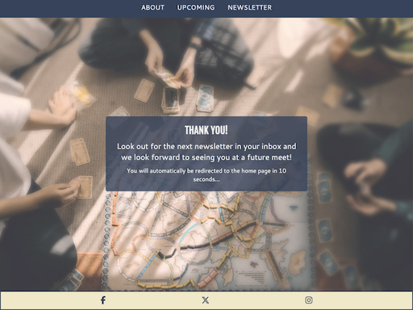
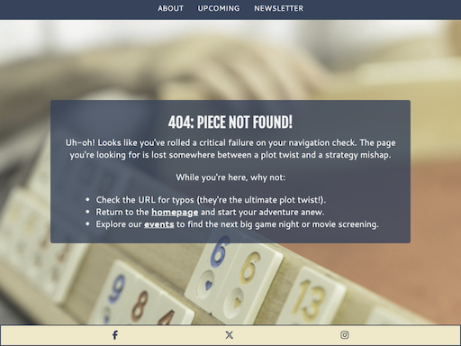

# Board Game & Film Club

Board Game & Film Club is a site to inform people about their local club in Maidstone where they can come and play games and watch films. It is targeted at both current members and potential new members who want a bit of classic fun and to make new friends. It will be useful to current and new members as it lists event details for future meets and also gives the opportunity to sign up to a newsletter via email. 

Source: [Techsini Multi Device Website Mockup Generator](http://techsini.com/multi-mockup/?url=https://apeskinian.github.io/p1_bgfc/)

## UX

The strategy was to create an easy to navigate website that introduced potential new members to the club and also gave existing members useful information about the club.

The scope of features I wanted to include were:
- Information on what the club is and what it's about (targeted at potential new members)
- Location of the club (targeted at potential new members)
- Dates of future events including what is happening on each date (for both existing and new members)
- A signup page for a newsletter for the club (for both existing and new members)

When looking at the site structure I decided all the information solely targeted for potential new members need to be on the homepage. This way there should be enough information about the club for them to decide if they would be interested. Information on the upcoming events on it's own page for two reasons, progressive disclosure for potential new members and also exising members can just bookmark this page rather than having to scroll past content they don't need. The newsletter form would be on it's on page as well.

While wireframing the site I decided to have the navbar at the bottom with a burger menu style for the smaller devices such as phones and tablets. This will make navigation easier when they are being browsed one handed. On larger devices the navbar moves back to the top. The images for the site were chosen that matched the content of the site and also were for a game that is very well known.

I then used the chosen hero image to generate the colour scheme for the site so that everything looked good together.

### Colour Scheme

- `#3a3a3a` Used for main home page text.
- `#f5f5f5` Used for header and rest of site primary text.
- `#3b4d66` Used as background for navbars and info boxes.
- `#f2eace` Used as background for footer.
- `#3b4d66` Used for social network icons and pop up navbar text.

I used [Colormind](http://colormind.io/) to generate my colour palette from the hero image.

### Typography

- [Fjalla One](https://fonts.google.com/specimen/Fjalla+One) was used for the primary headers and titles.

- [Cantarell](https://fonts.google.com/specimen/Cantarell) was used for all other secondary text.

- [Font Awesome](https://fontawesome.com) icons were used throughout the site for the social media icons in the footer.

🛑🛑🛑🛑🛑🛑🛑🛑🛑🛑 
## User Stories

### New Site Users

- As a new site user, I would like to ____________, so that I can ____________.
- As a new site user, I would like to ____________, so that I can ____________.
- As a new site user, I would like to ____________, so that I can ____________.
- As a new site user, I would like to ____________, so that I can ____________.
- As a new site user, I would like to ____________, so that I can ____________.

### Returning Site Users

- As a returning site user, I would like to ____________, so that I can ____________.
- As a returning site user, I would like to ____________, so that I can ____________.
- As a returning site user, I would like to ____________, so that I can ____________.
- As a returning site user, I would like to ____________, so that I can ____________.
- As a returning site user, I would like to ____________, so that I can ____________.

🛑🛑🛑🛑🛑🛑🛑🛑🛑🛑

## Wireframes

To follow best practice, wireframes were developed for mobile, tablet, and desktop sizes.
I've used [Balsamiq](https://balsamiq.com/wireframes) to design my site wireframes.

### Mobile Wireframes

 Click here to see the Mobile Wireframes 

Home
  - 

Upcoming Events
  - 

Newsletter
  - 

### Tablet Wireframes

 Click here to see the Tablet Wireframes 

Home
  - 

Upcoming Events
  - 

Newsletter
  - 

### Desktop Wireframes

 Click here to see the Desktop Wireframes 

Home
  - 

Upcoming Events
  - 

Newsletter
  - 

## Features
- ### Title & Hero Image
  - The title for the homepage floats above the hero image and scrolls with the page. The image used is a classic boardgame which is eyecatching and instantly recognisable. When the upcoming page is being viewed on tablet size and above, the title remains in place while the content scrolls next to it.

         

- ### Navigation Bar
  - The navigation bar appears differently depending on whether the user is on a hand held mobile device such as phones and tablets, or using larger devices such as Laptops and Desktops.
  - Hand held devices have the navigation bar at the bottom with a burger menu to access the links. This is for easier one handed accessibility. 
  
    
  
  - Larger devices have the navigation bar at the top of the page and the links are expanded so in view all the time.

    

- ### Club details section
  - This section tells the user the important information about the club including links to the appropriate sections of the site for more details on location, upcoming events and how to sign up to the newsletter.

    

- ### Map integration
  - The embedded Google map shows the location of where the club meets. This is for potential new members so they can see exactly where to find the club.
  - The link to open the larger map opens in a separate tab.

    

- ### Footer
  - The footer has the links to the clubs social media. This encourages the user to conmect via social media.
  - Links open in a separate tab.

    

- ### Upcoming Events page
  - This section of the site gives both current members and potential new members all the info they need on what's happening in upcoming meets.
  - This gives them the ability to plan whether they want to attend certain dates or not.

    

- ### Newsletter page
  - This page gives the user the option to sign up to an email newsletter that would send out info about the club.
  - This might include highlights of the last meet, details on the next few meets and any other interesting news.

    

- ### Newsletter confirmation page
  - This page confirms that the form submission has been successful and that they are signed up to receive the newsletter.

    

- ### 404 Error page
  - This page shows up when there has been a 404 error. It gives the user options to navigate to other pages of the site.

    

### Future Features

  - I would like to add a feature on the pages that the floating title scrolls. When the title scrolls out of view I'd like to change it to a static bar at the top similar to the navbar when it is at the top.
  - A forum page would also be good for members as they can discuss future meets, ideas about the club and connect.
  - It would be good for the data in the newsletter submission to actually be sent to the author of the website so that a newsletter can be sent.

## Tools & Technologies Used

-  used to generate README and TESTING templates.
-  used for version control. (`git add`, `git commit`, `git push`)
-  used for secure online code storage.
-  used as a cloud-based IDE for development.
-  used for the main site content.
-  used for the main site design and layout.
-  used for hosting the deployed front-end site.
-  used for creating wireframes.
-  used as an interactive map on my site.
-  used for the icons.

## Testing

> [!NOTE]  
> For all testing, please refer to the [TESTING.md](TESTING.md) file.

## Deployment

The site was deployed to GitHub Pages. The steps to deploy are as follows:

- In the [GitHub repository](https://github.com/apeskinian/p1_bgfc), navigate to the Settings tab 
- From the source section drop-down menu, select the **Main** Branch, then click "Save".
- The page will be automatically refreshed with a detailed ribbon display to indicate the successful deployment.

The live link can be found [here](https://apeskinian.github.io/p1_bgfc)

### Local Deployment

This project can be cloned or forked in order to make a local copy on your own system.

#### Cloning

You can clone the repository by following these steps:

1. Go to the [GitHub repository](https://github.com/apeskinian/p1_bgfc) 
2. Locate the Code button above the list of files and click it 
3. Select if you prefer to clone using HTTPS, SSH, or GitHub CLI and click the copy button to copy the URL to your clipboard
4. Open Git Bash or Terminal
5. Change the current working directory to the one where you want the cloned directory
6. In your IDE Terminal, type the following command to clone my repository:
	- `git clone https://github.com/apeskinian/p1_bgfc.git`
7. Press Enter to create your local clone.

Alternatively, if using Gitpod, you can click below to create your own workspace using this repository.

Please note that in order to directly open the project in Gitpod, you need to have the browser extension installed.
A tutorial on how to do that can be found [here](https://www.gitpod.io/docs/configure/user-settings/browser-extension).

#### Forking

By forking the GitHub Repository, we make a copy of the original repository on our GitHub account to view and/or make changes without affecting the original owner's repository.
You can fork this repository by using the following steps:

1. Log in to GitHub and locate the [GitHub Repository](https://github.com/apeskinian/p1_bgfc)
2. At the top of the Repository (not top of page) just above the "Settings" Button on the menu, locate the "Fork" Button.
3. Once clicked, you should now have a copy of the original repository in your own GitHub account!

🛑🛑🛑🛑🛑🛑🛑🛑🛑🛑
### Local VS Deployment

🛑🛑🛑🛑🛑🛑🛑🛑🛑🛑

## Credits

### Content

| Source | Location | Notes |
| --- | --- | --- |
| [Markdown Builder](https://tim.2bn.dev/markdown-builder) | README and TESTING | tool to help generate the Markdown files |
| [A Complete Guide to Flexbox](https://css-tricks.com/snippets/css/a-guide-to-flexbox/) | Entire Site | Using flexbox
| [W3Schools](https://www.w3schools.com/css/css_positioning.asp) | Entire Site | CSS position Property |
| [ChatGPT](https://openai.com/) | 404 Error Page | Witty 404 error message |

### Media

| Source | Location | Type | Notes |
| --- | --- | --- | --- |
| [favicon.io](https://favicon.io/emoji-favicons/game-die) | Entire site | Image | Favicon on all pages |
| [Pexels](https://www.pexels.com/photo/close-up-photo-of-monopoly-board-game-776654/) | Home Page | Image | Hero image |
| [Pexels](https://www.pexels.com/photo/three-teal-yellow-and-red-pens-776657/) | Upcoming Page | Image | Background image |
| [Pexels](https://www.pexels.com/photo/five-assorted-color-chess-pieces-776655/) | Newsletter Page | Image | Background image |
| [Pexels](https://www.pexels.com/photo/five-assorted-color-chess-pieces-776655/) | Newsletter Confirmation Page | Image | Background image |
| [Pexels](https://www.pexels.com/photo/five-assorted-color-chess-pieces-776655/) | 404 Error Page | Image | Background image |
| [TinyPNG](https://tinypng.com) | Entire site | Image | Tool for image compression |

### Acknowledgements

- I would like to thank my Code Institute mentor, [Tim Nelson](https://github.com/TravelTimN) for his support throughout the development of this project.
- I would like to thank the [Code Institute](https://codeinstitute.net) tutor team for their assistance with troubleshooting and debugging some project issues.
- I would like to thank the [Code Institute Slack community](https://code-institute-room.slack.com) for the moral support; it kept me going during periods of self doubt and imposter syndrome.
- I would like to thank my daughter Niamh, my sister Natalie and my whole family for believing in me, and supporting me while making this transition into software development.