# Testing

> [!NOTE]  
> Return back to the [README.md](README.md) file.

## Code Validation

### HTML

I have used the recommended [HTML W3C Validator](https://validator.w3.org) to validate all of my HTML files.

| Directory | File | Link | Screenshot |
| --- | --- | --- | --- |
|  | index.html | [Validate index.html](https://validator.w3.org/nu/?doc=https://apeskinian.github.io/p1_bgfc/index.html) |  |
|  | upcoming.html | [Validate upcoming.html](https://validator.w3.org/nu/?doc=https://apeskinian.github.io/p1_bgfc/upcoming.html) |  |
|  | newsletter.html | [Validate newsletter.html](https://validator.w3.org/nu/?doc=https://apeskinian.github.io/p1_bgfc/newsletter.html) |  |
|  | confirmation.html | [Validate confirmation.html](https://validator.w3.org/nu/?doc=https%3A%2F%2Fapeskinian.github.io%2Fp1_bgfc%2Fconfirmation.html) |  |
|  | 404.html | [Validate 404.html](https://validator.w3.org/nu/?doc=https%3A%2F%2Fapeskinian.github.io%2Fp1_bgfc%2F404.html) |  |

### CSS

I have used the recommended [CSS Jigsaw Validator](https://jigsaw.w3.org/css-validator) to validate all of my CSS files.

| Directory | File | Link | Screenshot |
| --- | --- | --- | --- |
| assets | style.css | [Validate style.css](https://jigsaw.w3.org/css-validator/validator?uri=https%3A%2F%2Fapeskinian.github.io%2Fp1_bgfc) |  |

## Browser Compatibility

I've tested my deployed project on multiple browsers to check for compatibility issues.

| Browser | Home | Upcoming Events | Newsletter | Confirmation | 404 | Notes |
| --- | --- | --- | --- | --- | --- | --- |
| Chrome |  |  |  | 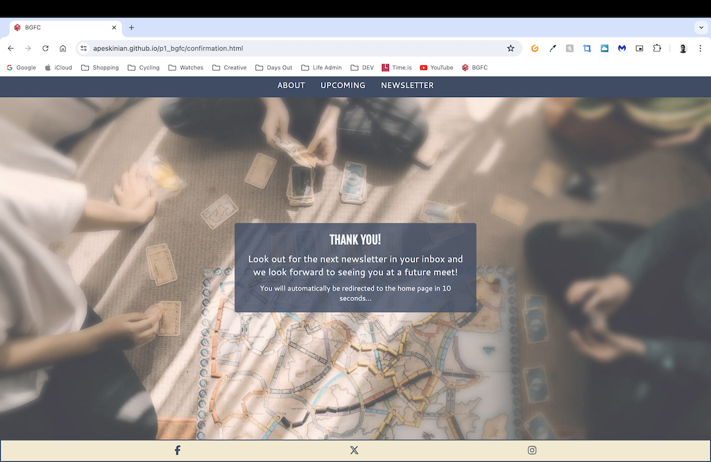 | 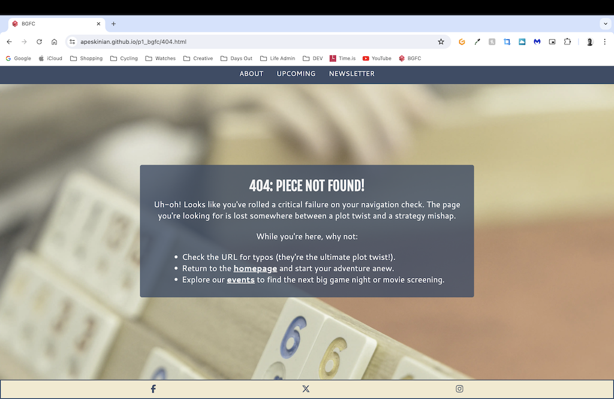 | Works as expected |
| Firefox |  |  |  |  |  | Works as expected |
| Edge |  |  |  |  |  | Works as expected |
| Safari |  |  | 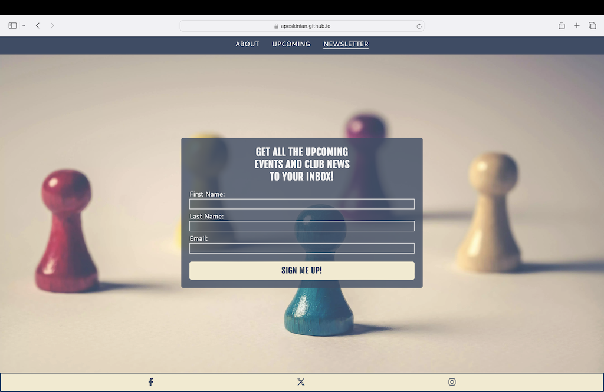 |  | 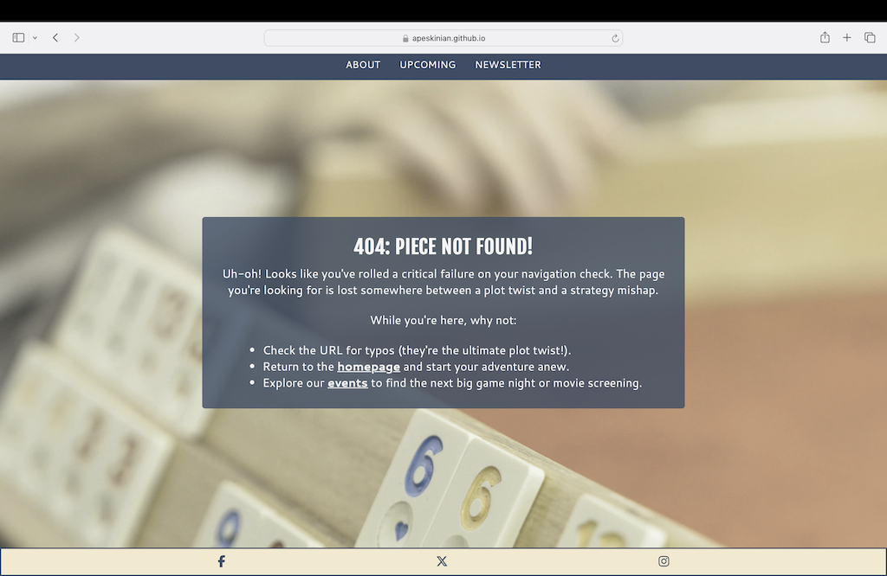 | Works as expected |

## Responsiveness

I've tested my deployed project on multiple devices to check for responsiveness issues.

| Device | Home | Upcoming | Newsletter | Confirmation | 404 | Notes |
| --- | --- | --- | --- | --- | --- | --- |
| Mobile (DevTools) |  |  |  |  | 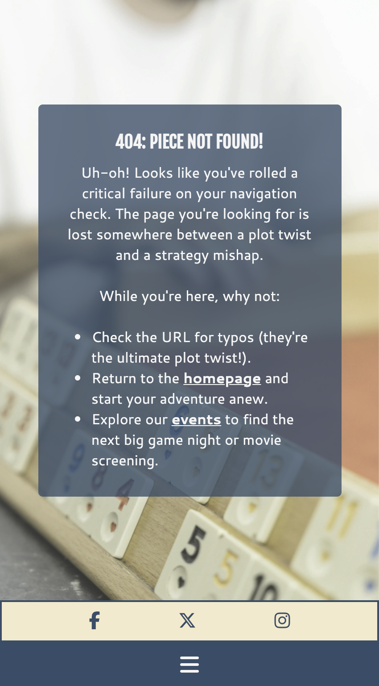 | Works as expected |
| Tablet (DevTools) |  |  |  |  |  | Works as expected |
| 4k Monitor (DevTools) |  |  |  |  | 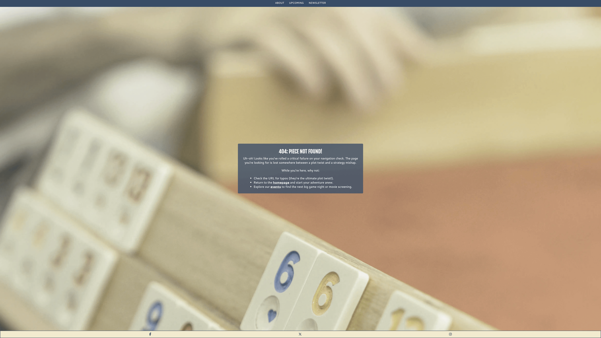 | Scaling issues beginning |
| iPhone 15 Pro |  |  |  |  |  | Works as expected |
| iPad Mini |  |  |  |  |  | Works as expected |
| MacBook Air M3 |  |  |  | 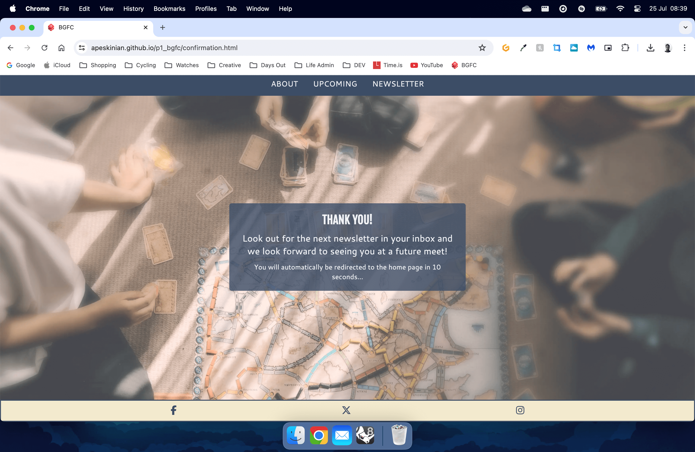 |  | Works as expected |
| 2K Desktop Monitor |  | 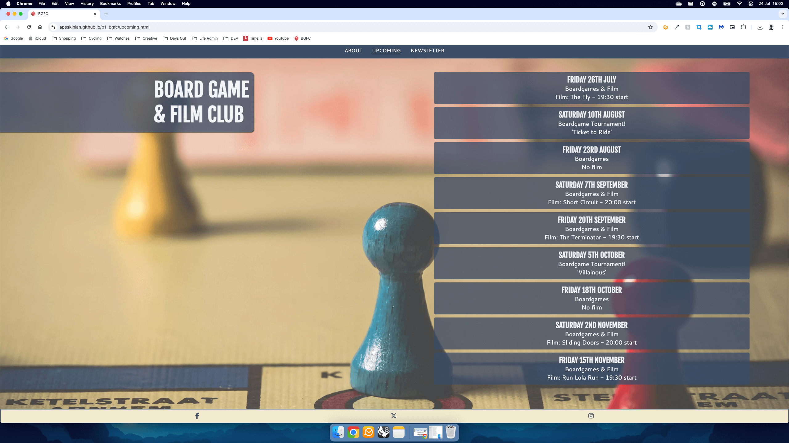 |  |  | 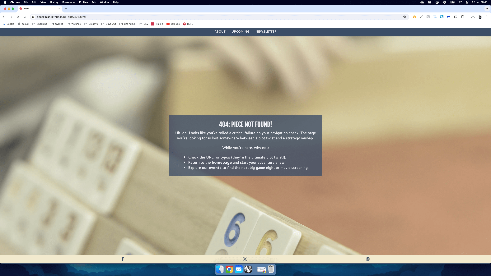 | Works as expected |

## Lighthouse Audit

I've tested my deployed project using the Lighthouse Audit tool to check for any major issues.

| Page | Mobile | Desktop | Notes |
| --- | --- | --- | --- |
| Home |  |  | Font Awesome and Google Fonts highlighted as render blocking resources on mobile |
| Upcoming |  |  | Some minor warnings |
| Newsletter |  |  | Some minor warnings |
| Confirmation | 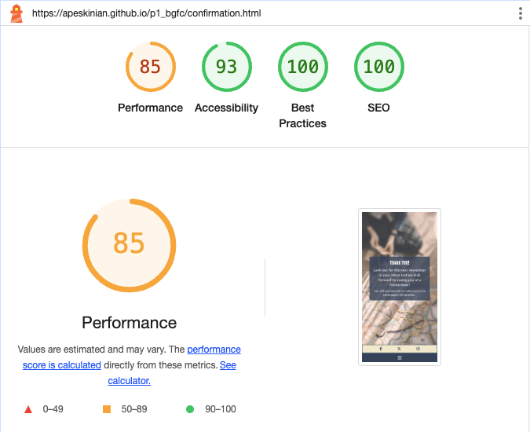 | 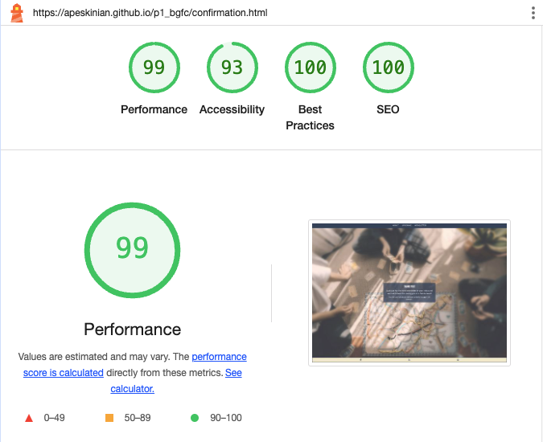 | Accessibility lowered due to automatic refresh meta tag, also Font Awesome and Google Fonts highlighted as render blocking resources on mobile |
| 404 | 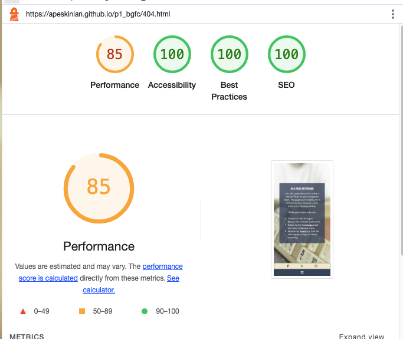 | 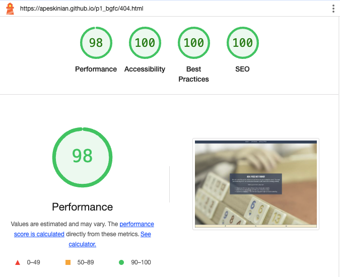 | Font Awesome and Google Fonts highlighted as render blocking resources on mobile |

## User Story Testing

| User Story | Screenshot |
| --- | --- |
| As a new site user, I would like to learn about what happens at the club, so that I can decide whether I would like to try it. |  |
| As a new site user, I would like to find out where the club meets, so that I can see if it's local enough for me. |  |
| As a new site user, I would like to learn when the next meetup is, so that I can see if I can attend that time. |  |
| As a returning site user, I would like to be kept up to date with events, so that I can see what's happening at the next meet. |  |
| As a returning site user, I would like to know about past events I may have missed, so that I can catch up on what happened and who won the last tournament. |  |

## Bugs

- A screenshot for the README.md was named bgfc-title&hero.png so was changed to bgfc-title-hero.png to remedy any issues that would have been caused.

> [!NOTE]  
> There are no remaining bugs that I am aware of.
